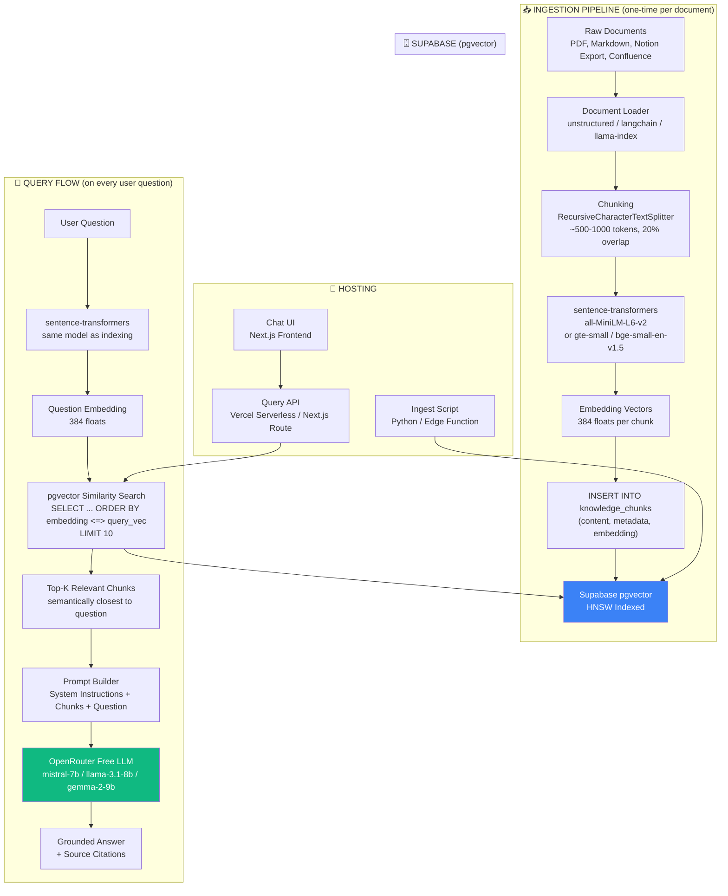

# RAG System Design — Organisational Knowledge Base

## Overview

This document describes a **Retrieval-Augmented Generation (RAG)** system built for an organisational knowledge base. There are two implementation tracks:

| Track | Vector Store | Runtime | Status |
|---|---|---|---|
| **Local prototype** | JSON files (`playground/embeddings/<org>/`) | Standalone Python CLI | 🟢 Working |
| **Target architecture** | Supabase pgvector | FastAPI + Vercel | 📝 Planned |

This document describes the **target architecture**. For the current working prototype, see:
- `playground/index_docs.py` — PDF → text → chunks → embeddings → JSON
- `playground/ask.py` — query → embed → cosine similarity → top-K chunks

The target architecture uses **Supabase pgvector** as the vector store, **sentence-transformers** for embeddings (local, free), and **OpenRouter free LLMs** for answer generation.

---

## Architecture Diagram



---

## Detailed Component Breakdown

### 1. Ingestion Pipeline

| Step | Component | Description | Library / Tool |
|---|---|---|---|
| **Load** | Document Loader | Reads raw files (PDF, Markdown, HTML, Confluence export, Notion export) and extracts text. | `unstructured`, `langchain_community.document_loaders`, `llama-index` |
| **Chunk** | Text Splitter | Splits documents into overlapping chunks of ~500–1000 tokens. Overlap (~20%) prevents context loss at boundaries. | `RecursiveCharacterTextSplitter` (langchain), `SemanticChunker` |
| **Embed** | Embedding Model | Converts each chunk into a fixed-size vector (384 dimensions). Local, free, no API key needed. | `sentence-transformers` (Python) |
| **Store** | Supabase pgvector | Inserts raw text + vector + metadata into a Postgres table with a vector index for fast retrieval. | Supabase SQL + `pgvector` |

#### Chunking Strategy

> ⚠️ **Important:** `RecursiveCharacterTextSplitter` uses `len()` (character count) by default — **not token count**. Without a custom `length_function`, `chunk_size=500` means 500 characters (~100–125 tokens), which is far too small. Always pass a token-aware length function.

```python
from langchain.text_splitter import RecursiveCharacterTextSplitter
from transformers import AutoTokenizer

tokenizer = AutoTokenizer.from_pretrained("sentence-transformers/all-MiniLM-L6-v2")

splitter = RecursiveCharacterTextSplitter(
    chunk_size=500,       # 500 tokens per chunk
    chunk_overlap=100,    # 20% overlap (~100 tokens)
    separators=["\n\n", "\n", ".", " ", ""],
    length_function=lambda x: len(tokenizer.encode(x))  # token-aware, not char-based
)
chunks = splitter.split_text(document_text)
```

#### Embedding Generation

```python
from sentence_transformers import SentenceTransformer

model = SentenceTransformer('all-MiniLM-L6-v2')  # 384-dim, free, local

embeddings = model.encode(chunks)  # returns numpy array of shape (n_chunks, 384)
```

---

### 2. Supabase Schema (pgvector)

```sql
-- Enable the extension
CREATE EXTENSION IF NOT EXISTS vector;

-- Create the knowledge chunks table
CREATE TABLE knowledge_chunks (
    id              BIGINT PRIMARY KEY GENERATED ALWAYS AS IDENTITY,
    content         TEXT NOT NULL,                           -- the raw chunk text
    metadata        JSONB DEFAULT '{}',                     -- source, author, date, tags, page, etc.
    embedding       VECTOR(384),                            -- 384-dim embedding vector
    created_at      TIMESTAMPTZ DEFAULT NOW(),
    updated_at      TIMESTAMPTZ DEFAULT NOW()
);

-- HNSW index for fast approximate nearest-neighbor search
CREATE INDEX idx_knowledge_chunks_embedding
    ON knowledge_chunks
    USING hnsw (embedding vector_cosine_ops);
```

**Why HNSW?** Hierarchical Navigable Small World graphs provide the best balance of speed and recall. Indexing is slower than IVFFlat, but queries are significantly faster at scale (millions of rows).

**Why cosine distance (`<=>`)?** Cosine similarity measures angular distance between vectors, which works well for semantic similarity regardless of vector magnitude.

**Optional: Metadata filtering**

```sql
-- Add GIN index for faster metadata queries
CREATE INDEX idx_knowledge_chunks_metadata ON knowledge_chunks USING gin (metadata);

-- Query with metadata filter
SELECT content, 1 - (embedding <=> :query_vec) AS similarity
FROM knowledge_chunks
WHERE metadata->>'department' = 'engineering'
ORDER BY embedding <=> :query_vec
LIMIT 10;
```

---

### 3. Query Flow (detailed)

When a user asks a question, the system performs these steps in sequence:

#### Step 1: Embed the Question

```python
question = "What is our deployment policy?"
question_embedding = model.encode([question])[0]  # 384-dim vector
```

The same `sentence-transformers` model used during indexing must be used here so that both the documents and the question live in the same vector space.

#### Step 2: Similarity Search in pgvector

```python
# Using Supabase Python client
result = supabase.rpc('match_knowledge_chunks', {
    'query_embedding': question_embedding.tolist(),
    'match_threshold': 0.5,   # minimum similarity score
    'match_count': 10         # top-K results
}).execute()
```

**Under the hood**, this runs:

```sql
CREATE OR REPLACE FUNCTION match_knowledge_chunks(
    query_embedding VECTOR(384),
    match_threshold FLOAT,
    match_count INT
)
RETURNS TABLE (
    content TEXT,
    metadata JSONB,
    similarity FLOAT
)
LANGUAGE SQL STABLE
AS $$
    SELECT
        content,
        metadata,
        1 - (knowledge_chunks.embedding <=> query_embedding) AS similarity
    FROM knowledge_chunks
    WHERE 1 - (knowledge_chunks.embedding <=> query_embedding) > match_threshold
    ORDER BY knowledge_chunks.embedding <=> query_embedding
    LIMIT match_count;
$$;
```

**How pgvector finds matches:**
1. The HNSW index partitions the vector space into a multi-layered graph.
2. Starting from an entry point, it navigates through the graph, at each step moving to the nearest neighbor.
3. As it descends layers, the search becomes more granular.
4. It returns the top-K nearest vectors by cosine distance (`<=>` operator).

This is **not a full table scan** — the index makes it O(log n) instead of O(n).

#### Step 3: Build the LLM Prompt

```python
prompt = f"""You are a knowledge assistant for the organisation.
Answer the user's question based ONLY on the context provided below.
If the context does not contain enough information, say "I don't have enough information."
Always cite the source document name from the metadata.

CONTEXT:
{chr(10).join([f"[Source: {c['metadata']['source']}] {c['content']}" for c in chunks])}

---

QUESTION: {question}

ANSWER:"""
```

#### Step 4: Validate Context Window Budget

Before sending the prompt, check it fits the model's context window:

```python
# Token budget breakdown (Mistral 7B: 8,192 token context)
SYSTEM_PROMPT_TOKENS  = 150    # instructions + framing
CONTEXT_TOKENS        = top_k * chunk_size  # e.g. 10 * 500 = 5,000
QUESTION_TOKENS       = 50     # typical user question
ANSWER_BUFFER_TOKENS  = 512    # reserved for generated answer
TOTAL_BUDGET          = 8192

MAX_CHUNKS = (TOTAL_BUDGET - SYSTEM_PROMPT_TOKENS - QUESTION_TOKENS - ANSWER_BUFFER_TOKENS) // chunk_size
# → MAX_CHUNKS ≈ 15 for Mistral 7B; 10 is safe

# If using Llama 3.1 8B (128k context), this constraint is negligible
```

For Mistral 7B, **top_k=10 chunks at 500 tokens each = 5,000 tokens** — this fits within the 8,192 limit but leaves only ~2,500 tokens for system instructions, question, and answer. Prefer Llama 3.1 8B (128k context) if you expect large chunks or long answers.

#### Step 5: Generate Answer via OpenRouter

```python
import requests

response = requests.post(
    "https://openrouter.ai/api/v1/chat/completions",
    headers={
        "Authorization": f"Bearer {OPENROUTER_API_KEY}",
        "Content-Type": "application/json"
    },
    json={
        "model": "mistralai/mistral-7b-instruct:free",  # or llama-3.1-8b, gemma-2-9b
        "messages": [{"role": "user", "content": prompt}],
        "temperature": 0.3  # low temperature for factual answers
    }
)

answer = response.json()["choices"][0]["message"]["content"]
```

> ⚠️ **OpenRouter Free Tier Rate Limits:** Free models are rate-limited (typically ~20 requests/min per model, subject to change). For concurrent org usage this will be a bottleneck. Mitigation options:
> - Implement a request queue with exponential backoff
> - Rotate across multiple free models (Mistral → Llama → Gemma) to spread load
> - Add semantic response caching (see Potential Improvements) to avoid hitting the LLM for repeated queries
> - Budget ~$5–10/month for a paid OpenRouter tier if concurrent load is a consistent issue

---

### 4. Deployment Architecture

| Component | Host | Tech |
|---|---|---|
| Vector Database | Supabase (already provisioned) | Postgres + pgvector |
| Ingestion Script | Local / CI pipeline | Python (sentence-transformers) |
| **Embedding Service** | **Fly.io / Render (free tier)** | **FastAPI + sentence-transformers** |
| Query API | Vercel Serverless Function | Node.js (calls Embedding Service) |
| Chat UI | Vercel (existing project) | Next.js |
| LLM | OpenRouter API | Any free model |

#### ⚠️ Why sentence-transformers Cannot Run on Vercel Serverless

Running `sentence-transformers` directly inside a Vercel Serverless function has two blockers:

1. **Package size** — `sentence-transformers` + PyTorch exceeds Vercel's 250MB deployment limit.
2. **Cold start latency** — Loading the model from disk on a cold start takes 10–30 seconds, making the API unusable for real users.

#### Recommended Fix: Dedicated Embedding Service

Deploy a lightweight FastAPI app on Fly.io or Render (both have free tiers). This handles embedding at both ingest time and query time, keeping Vercel stateless and fast.

```python
# embedding_service/main.py  (deploy to Fly.io / Render)
from fastapi import FastAPI
from sentence_transformers import SentenceTransformer
from pydantic import BaseModel

app = FastAPI()
model = SentenceTransformer("all-MiniLM-L6-v2")  # loaded once on startup

class EmbedRequest(BaseModel):
    texts: list[str]

@app.post("/embed")
def embed(req: EmbedRequest):
    vectors = model.encode(req.texts).tolist()
    return {"embeddings": vectors}
```

The Vercel Query API then calls this service instead of running the model locally:

```typescript
// pages/api/query.ts
const embRes = await fetch(process.env.EMBEDDING_SERVICE_URL + "/embed", {
  method: "POST",
  headers: { "Content-Type": "application/json" },
  body: JSON.stringify({ texts: [question] }),
});
const { embeddings } = await embRes.json();
const questionEmbedding = embeddings[0];  // 384-dim vector
```

#### Alternative: ONNX in Node.js (no separate service needed)

If you want to avoid a separate service entirely, use `@xenova/transformers` — it runs the same model family via ONNX in Node.js, compatible with Vercel's Node runtime and well within the size limit.

```typescript
import { pipeline } from "@xenova/transformers";

const embedder = await pipeline("feature-extraction", "Xenova/all-MiniLM-L6-v2");
const output = await embedder(question, { pooling: "mean", normalize: true });
const questionEmbedding = Array.from(output.data);  // 384-dim
```

---

### 5. Authentication & Access Control

For an organisational knowledge base, **employees must only retrieve documents they are authorised to see** (e.g., HR docs should not be visible to engineers unless explicitly permitted).

#### Query API — JWT Validation

Every request to the Query API must carry a valid JWT. Verify it before executing any vector search.

```typescript
// pages/api/query.ts
import { createClient } from "@supabase/supabase-js";

export default async function handler(req, res) {
  const token = req.headers.authorization?.replace("Bearer ", "");
  if (!token) return res.status(401).json({ error: "Unauthorised" });

  // Validate token and extract user claims
  const supabase = createClient(process.env.SUPABASE_URL, process.env.SUPABASE_ANON_KEY, {
    global: { headers: { Authorization: `Bearer ${token}` } },
  });

  const { data: { user }, error } = await supabase.auth.getUser();
  if (error || !user) return res.status(401).json({ error: "Invalid token" });

  // Pass user metadata (e.g., department) to the vector search
  const department = user.user_metadata?.department;
  // ... proceed with vector search, filtering by department
}
```

#### Supabase Row Level Security (RLS)

Enable RLS on `knowledge_chunks` to enforce access at the database level — a defence-in-depth layer even if the API layer has a bug.

```sql
-- Enable RLS
ALTER TABLE knowledge_chunks ENABLE ROW LEVEL SECURITY;

-- Policy: users can only read chunks matching their department
-- (JWT claims are accessible via auth.jwt() in Supabase)
CREATE POLICY "department_access" ON knowledge_chunks
  FOR SELECT
  USING (
    metadata->>'department' = (auth.jwt() -> 'user_metadata' ->> 'department')
    OR metadata->>'visibility' = 'public'
  );
```

#### Metadata Schema for Access Control

Extend the `metadata` JSONB field to carry access attributes on every chunk:

```json
{
  "source": "hr-handbook-2024.pdf",
  "doc_id": "hr-handbook-2024",
  "chunk_id": "hr-handbook-2024:p001:c0007",
  "chunk_order": 7,
  "department": "hr",
  "visibility": "private",
  "page": 12
}
```

#### Stable Chunk IDs For Citation Fidelity

Do not rely on retrieval rank (`chunk #1`, `chunk #2`, etc.) as the primary citation handle. Retrieval rank changes from query to query, so it is not a durable identifier.

Instead, assign each stored chunk a **stable chunk identifier** during ingestion and keep it in metadata (or a dedicated column if you prefer stricter schema guarantees).

Recommended fields:

- `chunk_id`: globally unique per chunk, stable across queries
- `chunk_order`: zero- or one-based sequence number within the document
- `page`: source page number when available
- `source_hash`: document version fingerprint

Recommended format:

```text
{doc_id}:p{page-or-000}:c{chunk_order}
```

Example:

```text
hr-handbook-2024:p012:c0007
```

This improves:

- citation stability in answers
- traceability during debugging
- safer document re-ingestion and replacement
- future UI links back to source excerpts or pages

---

### 6. Document Update & Delete Strategy

When a source document changes, stale chunks from the old version must be removed before re-ingesting.

#### Schema Addition

```sql
-- Add a stable doc identifier to track all chunks per document
-- (metadata->>'doc_id' already handles this, but a dedicated column is faster to index)
ALTER TABLE knowledge_chunks ADD COLUMN doc_id TEXT GENERATED ALWAYS AS (metadata->>'doc_id') STORED;
CREATE INDEX idx_knowledge_chunks_doc_id ON knowledge_chunks (doc_id);
```

#### Avoid `doc_id` Collision Risk

Do not use `file_path.stem` alone as the long-term `doc_id`. It is convenient for an MVP, but it will collide when:

- two different files share the same filename in different folders
- the same logical document is re-uploaded with a renamed file
- documents eventually come from multiple upstream systems

Prefer separating **logical document identity** from the uploaded filename:

- `doc_id`: stable logical identifier for the document
- `source`: original filename shown to users
- `source_hash`: content fingerprint for change detection

Recommended strategies for `doc_id` (best to worst):

1. Source-system ID from Notion, Confluence, Drive, etc.
2. Explicit document ID supplied by the ingestion caller
3. Namespaced slug such as `{department}/{folder}/{filename-stem}`
4. Plain filename stem only as a short-lived local fallback

If no upstream ID exists, a good MVP compromise is to require or derive a namespaced ID and store the filename separately for display.

#### Ingestion Script — Upsert Pattern

```python
import hashlib

def get_source_hash(file_path: str) -> str:
    """Fingerprint the document to detect changes."""
    with open(file_path, "rb") as f:
        return hashlib.sha256(f.read()).hexdigest()

def make_chunk_id(doc_id: str, chunk_order: int, page: int | None = None) -> str:
    page_part = f"p{page:03d}" if page is not None else "p000"
    return f"{doc_id}:{page_part}:c{chunk_order:04d}"

def ingest_document(file_path: str, doc_id: str, metadata: dict):
    current_hash = get_source_hash(file_path)

    # Check if this version is already indexed
    existing = supabase.table("knowledge_chunks") \
        .select("id") \
        .eq("doc_id", doc_id) \
        .limit(1) \
        .execute()

    stored_hash = supabase.table("doc_registry") \
        .select("source_hash") \
        .eq("doc_id", doc_id) \
        .maybe_single() \
        .execute()

    if stored_hash.data and stored_hash.data["source_hash"] == current_hash:
        print(f"[SKIP] {doc_id} unchanged")
        return

    # Delete old chunks for this document
    supabase.table("knowledge_chunks").delete().eq("doc_id", doc_id).execute()
    print(f"[DELETE] removed old chunks for {doc_id}")

    # Re-ingest
    chunks = splitter.split_text(load_document(file_path))
    embeddings = model.encode(chunks)

    rows = [
        {
            "content": chunk,
            "embedding": emb.tolist(),
            "metadata": {
                **metadata,
                "doc_id": doc_id,
                "source": file_path.name,
                "source_hash": current_hash,
                "chunk_order": chunk_order,
                "chunk_id": make_chunk_id(doc_id, chunk_order),
            },
        }
        for chunk_order, (chunk, emb) in enumerate(zip(chunks, embeddings), start=1)
    ]
    supabase.table("knowledge_chunks").insert(rows).execute()

    # Update doc registry
    supabase.table("doc_registry").upsert({
        "doc_id": doc_id,
        "source_hash": current_hash,
        "source": file_path.name,
    }).execute()
    print(f"[DONE] indexed {len(rows)} chunks for {doc_id}")
```

You will also need a `doc_registry` table to track hashes:

```sql
CREATE TABLE doc_registry (
    doc_id      TEXT PRIMARY KEY,
    source      TEXT,
    source_hash TEXT NOT NULL,
    updated_at  TIMESTAMPTZ DEFAULT NOW()
);
```

---

## Data Flow Diagram (Text View)

```
DOCUMENT INGESTION:
  Raw Doc → Loader → Chunks → Embedder → Supabase INSERT
                                              ↓
                                     knowledge_chunks table
                                     ┌─────────────────────┐
                                     │ id | content | meta | embedding │
                                     └─────────────────────┘
                                              ↑
USER QUERY:
  Question → Embedder → pgvector SEARCH → Top-10 Chunks → Prompt → LLM → Answer
```

---

## Key Design Decisions

| Decision | Choice | Rationale |
|---|---|---|
| Embedding Model | `all-MiniLM-L6-v2` (384-dim) | Free, local, fast, good quality. No API costs. |
| Vector DB | Supabase pgvector | Already owned, co-located with other data, no new infra. |
| Index Type | HNSW | Fastest queries at scale. Slightly slower indexing, worth it. |
| Distance Metric | Cosine (`<=>`) | Best for semantic similarity. Insensitive to vector magnitude. |
| LLM | OpenRouter free tier | Zero cost. Models: Mistral 7B, Llama 3.1 8B, Gemma 2 9B. |
| Chunk Size | 500 tokens | Balances context richness with precision. |
| Chunk Overlap | 20% (100 tokens) | Prevents context loss at chunk boundaries. |
| Temperature | 0.3 | Low temp for factual, deterministic answers. |

---

## Potential Improvements

- **Hybrid Search**: Combine vector similarity with keyword search (BM25 / pg_bigm) for better recall on exact matches (e.g., code snippets, product names, IDs that semantics alone won't surface).
- **Re-ranking**: After retrieving top-50 chunks, re-rank with a cross-encoder (e.g., `BAAI/bge-reranker-v2-m3`) for precision. Adds ~100ms but significantly improves answer quality.
- **Metadata Pre-filtering**: Filter chunks by department, doc type, date range before vector search. Already partially supported via the GIN index on `metadata`.
- **Chunk Refinement**: Use LLM to rewrite or compress chunks after retrieval to fit more context into the prompt.
- **Feedback Loop**: Log which chunks were used and thumbs-up/down on answers to improve chunking and retrieval over time.
- **Multi-modal**: Support images, diagrams, and tables in documents via vision models or OCR + captioning.
- **Query Rewriting / HyDE**: Users ask colloquially; documents use formal language. Two approaches:
  - *Query rewriting*: Use a small LLM to rephrase the user's question into the style of an expected answer before embedding.
  - *HyDE (Hypothetical Document Embeddings)*: Generate a hypothetical answer to the question, embed that instead of the question itself. Often dramatically improves recall.
  ```python
  # HyDE example
  hypothetical_answer = llm.generate(f"Write a brief answer to: {question}")
  query_embedding = model.encode([hypothetical_answer])[0]  # embed the hypothesis, not the question
  ```
- **Semantic Response Caching**: Cache recent `(question_embedding, answer)` pairs. On each new query, check if the embedding is within a cosine threshold of a cached query — if so, return the cached answer directly. Avoids LLM latency and OpenRouter rate limits for repeated/similar questions.
  ```python
  CACHE_THRESHOLD = 0.95  # high similarity = effectively the same question
  for cached_embedding, cached_answer in response_cache:
      similarity = cosine_similarity(question_embedding, cached_embedding)
      if similarity >= CACHE_THRESHOLD:
          return cached_answer  # cache hit, skip LLM call
  ```
- **HNSW Parameter Tuning**: The index creation above uses pgvector defaults (`m=16, ef_construction=64`). For a knowledge base with tens of thousands of chunks, tune these:
  ```sql
  CREATE INDEX idx_knowledge_chunks_embedding
      ON knowledge_chunks
      USING hnsw (embedding vector_cosine_ops)
      WITH (m = 32, ef_construction = 128);  -- better recall, ~2x index build time
  ```
  Also set `SET hnsw.ef_search = 100;` at query time (default is 40) for higher recall at the cost of slightly more CPU per query.

---

## Cost Breakdown

| Resource | Cost |
|---|---|
| Supabase (pgvector) | Already paid for |
| Sentence Transformers | Free (local CPU) |
| OpenRouter free LLMs | Free (rate-limited) |
| Vercel hosting | Already paid for |
| **Total additional** | **$0** |
